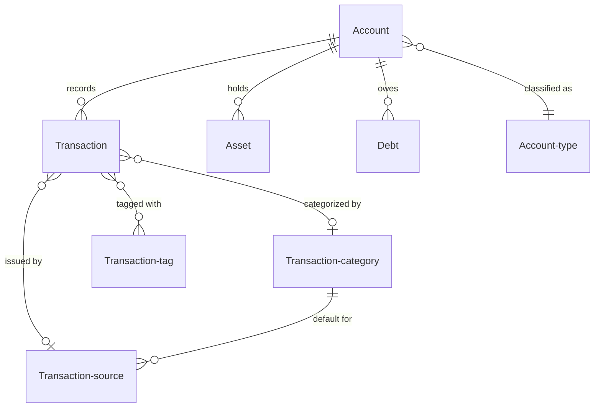
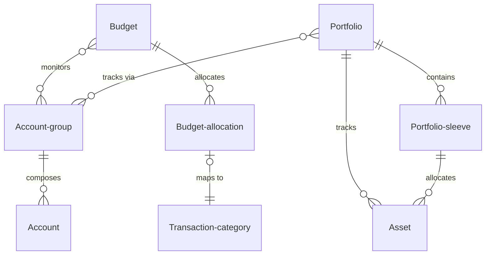
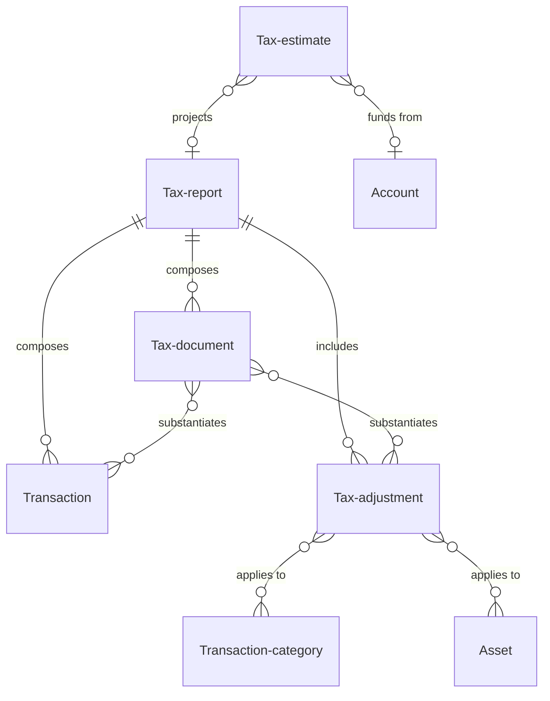
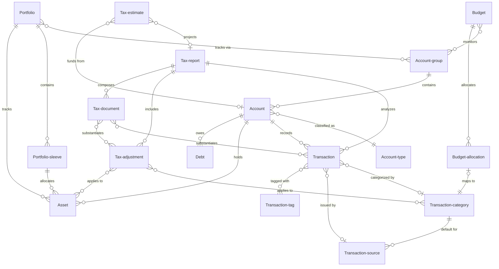
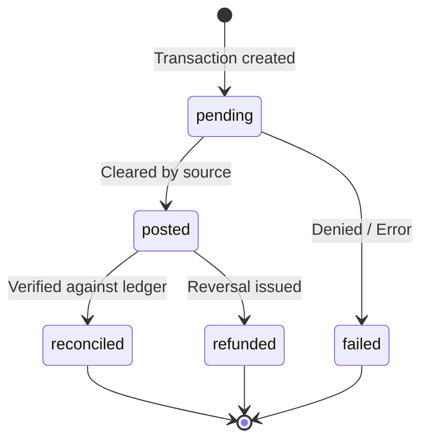
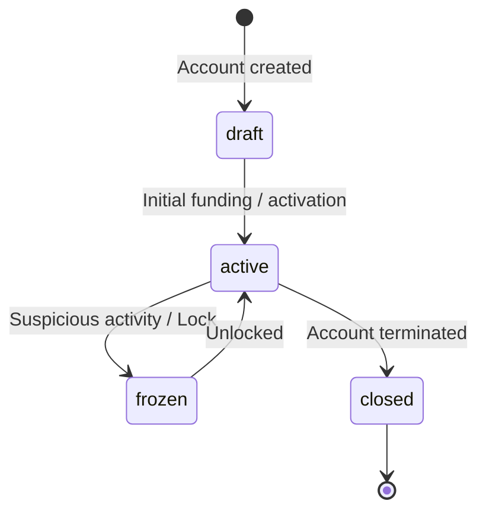
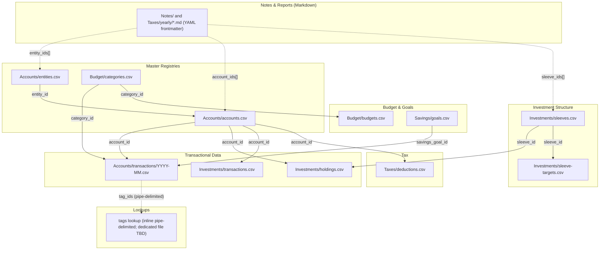

## Document overview

1. **User stories** to provide context to the workflows objects and features facilitate.
2. **Object definitions** to define the structure of the app and how objects connect.
3. Rulesets
4. **Object references** are diagrams for how Objects, Features and Rulesets work together.
5. **Flat File Storage Strategy** details how data is stored and managed within the app using a filing system structure and iCloud.
6. **Architectural Recommendations** are additional considerations to potentially add as part of this review.

## User stories
These user stories are meant to provide context as to the overall functionality of the app and intended use.
* As a user I want to take full control over my financial planning personal, business and retirement. I want the tools to enable me acting as my own accountant, financial advisor and retirement planner.
- As a user I want to be review all my financial accounts across in one place. I have multiple accounts associated with different parts my life and different parts of my life have multiple accounts so its difficult to keep track of it all. I want to be able to review individual accounts and group them in a way that relates to my life. For example, for work I have a W2 based paycheck which is broken up into an HSA contribution, Insurance payment, 401k contributions, tax payments and take home pay. I also side business income, a brokerage account, credit cards, multiple savings and checking accounts and so on. I want to be able to organize these accounts in one place by downloading transaction and making manual adjustments to get a full picture of my financial history and current state. 
- As a user I want to be able to create budgets monitor specific accounts compared to those budgets, to set goals for spending and review how my spending habits compare to the goals I set. As part of those budgets I also want to set goals for savings contributions and investments, to make sure I consistently build my wealth on a monthly basis.
- As a user I want to be able to review my financial portfolio for wealth management based on specific accounts, assets and liabilities. I want to be able to view different portfolios and portfolio sleeves. For example, my investment accounts would be form a core investment portfolio with multiple sleeves and smaller satellite portfolios might represent specific short term goals and be comprised of both an investment and savings account. Realestate investments might make up a different portfolio.
- As a user I want to understand how my various income sources are taxed so I can prepare on a yearly basis to prep for taxes. I also want to keep track of important files for this tax year as well as previous years. I want to understand what I pay on a yearly basis as well as what I’ve already paid this year and still need to pay.
- As a user I want full control of my financial information in one place. I want to review my full financial history in order to plan for the future. I want a file system I can interact with like an app, as well as run analysis with different AI tools. To best work with AI, I want to manage data through markdown, CSV, yaml, json, python and other standardized file formats.

## Object definitions

### Overview of Property Definitions
To ensure consistency and clarity across the architecture, every object is defined using a standard set of attributes. This uniform structure helps in understanding the role, data composition, and relationships of each object within the system. If a specific attribute does not apply to an object, its bullet is left blank.

The standard property groupings are:
- **description**: A brief, high-level summary of what the object represents.
- **purpose**: The "why"—the specific role this object plays in the overall system and the value it provides to the user.
- **properties**: The core data fields, metadata, or state variables stored within the object.
- **inherits-from**: Used when an object is a specialized subtype of a master object, sharing its core registry but adding specific fields.
- **belongs-to**: The inverse of "composes" or "references". Useful for defining the relationship from the perspective of the child object looking up.
- **composes**: A list of child objects or lower-level entities that this object contains or groups together.
- **references**: Other related objects that this object interacts with or references, outside of direct parent-child aggregation.
- **actions**: The operations, state changes, or user interactions that can be performed on or by this object.

~ NOTE:
- standard properties have been updated to better describe relationships 
~ END NOTE:

### Core Objects
These are objects that are used throughout the system and act as primary stores of value and means of organization. Core objects represent the raw financial data that everything else in the system is built upon.

##### Account
- description: Represents a specific account like savings, checking, brokerage, etc. Stores transactions, assets, and debts.
- purpose: Acts as the primary ledger for tracking balances, liquidity, and financial activity for a specific financial institution or holding.
- properties:
	- Account-ID (string, primary key)
	- Name (string)
	- Account-type-ID (reference)
	- Group-ID (reference, optional)
	- Current-balance (number)
	- Available-balance (number)
	- Status (string/enum: draft, active, frozen, closed)
	- Type (string/enum: cash, savings, brokerage, crypto, credit card, loan, mortgage, ira, 401k, etc.)
- inherits-from:
	- account-group
- belongs-to:
	- 
- composes:
	- Assets
	- Liabilities
	- Transactions 
- references:
	- Account-group
	- Budget
	- Portfolio
	- Tax-report
- actions:
	- Add, Edit, Delete
	- Manage transactions (add, edit, delete)
	- Manage assets (add, edit, delete)
	- Manage debts (add, edit, delete)

##### Transaction
- description: A purchase, sale, or transfer of money to obtain a service or good. Defines values for all financial items and keeps a record of how values change over time. Transactions are the backbone of the entire system because the full list of transactions gives a clear view of current and past financial states.
- purpose: Serves as the fundamental unit of financial activity, tracking the flow of money in, out, and within the user's financial ecosystem.
- properties:
	- Transaction-ID (string, primary key)
	- Description (string)
	- Date (date)
	- Amount (number)
	- Account-ID (reference)
	- Type (string/enum: income, expense, transfer)
	- Status (string/enum: pending, posted, reconciled, failed, refunded)
	- Category-ID (reference, optional)
	- Source-ID (reference, optional)
	- Tags (array of references, optional)
	- Notes (string, optional)
- inherits-from:
	- Account
- belongs-to:
	- Asset
	- Liability
	- Account
- composes:
	- 
- references:
	- Account
	- Transaction-category
	- Transaction-source
	- Transaction-tag
	- Tax-report
- actions:
	- Add, Edit, Delete
	- Categorize
	- Split transaction

##### Asset
- description: A holding of wealth like cash, stocks, crypto, real estate, etc. It can be associated with transactions but can also be edited directly.
- purpose: Represents positive value on the user's balance sheet, tracked over time to measure net worth.
- properties:
	- Asset-ID (string, primary key)
	- Name (string)
	- Type (string/enum: cash, equity, crypto, real-estate)
	- Current-value (number)
	- Cost-basis (number)
	- Account-ID (reference)
	- Ticker-symbol (string, optional)
	- Quantity (number, optional)
- inherits-from:
	- Account
- belongs-to:
	- Account
- composes:
	- Transactions
- references:
	- Portfolio
	- Portfolio-sleeve
	- Tax-adjustment
- actions:
	- Add, Edit, Delete
	- Update valuation
	- Link to transactions (buy/sell)

##### Liability
- description: A debt position that needs to be repaid, like a line of credit or loan.
- purpose: Represents negative value on the user's balance sheet. Tracking debts is critical for net worth calculations and payoff planning.
- properties:
	- Liability-ID (string, primary key)
	- Name (string)
	- Type (string/enum: credit-card, loan, mortgage)
	- Principal-balance (number)
	- Interest-rate (number)
	- Account-ID (reference)
	- Minimum-payment (number, optional)
	- Due-date (date, optional)
- inherits-from:
	- Account
- belongs-to:
	- Account
- composes:
	- Transactions
- references:
	- Account
- actions:
	- Add, Edit, Delete
	- Record payment (creates Transaction)
	- Update interest rate

~ CORE OBJECT NOTES:
* Transactions should tie more closely to assets and liabilities since they directly contribute to their creation and management.
* All accounts should contain at least one asset, liability or both. For example, a brokerage account would contain multiple assets (stocks & ETFs) and a mortgage account would contain both an asset snd liability (house and loan).
* Transactions entries within an account should relate to either and asset or liability. 
* When uploading transactions directly to an account, transactions can create an asset or liability but need manual review.
* Add “sending asset” as a property.
* Add “ receiving asset” as a property
* Example one: when purchasing Apple stock, the sending asset will be USD (US currency) while the receiving asset will be APPL. The value would be added to the asset’s balance (cost basis).
* Example two: when purchasing food from a restaurant the sending asset is USD but the receiving asset is blank or null, because it’s simply an expense.
* transaction types should also be updated to account for investing. Add “trade” as a transaction type.
* The “trade” transaction type should be used for all transactions involving both a sending and receiving asset.
* Assets may be dynamically added as part of a transactions import or manually created. Dynamically created assets need manual approval.
* In the case of credit card transactions where the sending asset is blank or null, it’s treated as an expense and adds to a liability balance.
* In the case of a loan the “credit” type would be used while the sending asset would be blank or null and the receiving asset would be currency (most likely USD).
* Credit card payments, loan payments and other payments towards liabilities should be treated as “Transfers”.
* All transfers should follow a multi-entry transaction structure where multiple entries across accounts may be added and connected by a single transaction ID.
* multi-entry example 1: 
	* id-1, checking account, transfer, -100
	* id-1, credit account, transfer, +100
* multi-entry example 2: 
	* id-1, checking account, transfer, -100
	* id-1, mortgage account (principal payment), transfer, +75
	* id-1, mortgage account (interest payment), expense, +25
* Multi-entry transactions should always equal 0
~ END NOTES:

### Aggregators
Aggregators act as containers or organizers that pull together multiple core objects for targeted analysis or review.

##### Account-group
- description: Connects multiple accounts into themes or entities like a place of employment or grouping of personal credit cards.
- purpose: The Account-group acts as the primary connecting object in the system. It composes lower objects and connects larger ones.
- properties:
	- Group-ID (string, primary key)
	- Name (string)
	- Description (string, optional)
	- Type (string/enum: personal, employment, business)
- inherits-from:
	- 
- belongs-to:
	- 
- composes:
	- 
- references:
	- Account
	- Budget
	- Portfolio
	- Tax-report
- actions:
	- Add, Edit, Delete
	- Link/un-link account

##### Transaction-category
- description: A grouping mechanism to classify transactions for budgeting and reporting purposes (e.g., Groceries, Rent, Salary).
- purpose: Allows users to understand where their money is coming from and going, enabling budget tracking and spending analysis.
- properties:
	- Category-ID (string, primary key)
	- Name (string)
	- Type (string/enum: income, expense)
	- Parent-category-ID (reference, optional for sub-categories)
	- Icon (string/url, optional)
	- Color (string/hex, optional)
- inherits-from:
	- 
- belongs-to:
	- 
- composes:
	- 
- references:
	- Transaction
	- Transaction-source
	- Budget-allocation
	- Tax-adjustment
- actions:
	- Add, Edit, Delete
	- Merge categories
	- Reassign transactions

##### Transaction-tag
- description: A flexible, user-defined label applied to transactions for ad-hoc organization across different categories (e.g., #vacation2026, #tax-deductible).
- purpose: Provides a secondary dimension of tracking that doesn't fit neatly into the primary category structure.
- properties:
	- Tag-ID (string, primary key)
	- Name (string)
	- Color (string/hex, optional)
- inherits-from:
	- 
- belongs-to:
	- 
- composes:
	- 
- references:
	- Transaction
- actions:
	- Add, Edit, Delete
	- Apply to transaction

##### Transaction-source
- description: The issuer of a transaction. In the case of an expense it's likely a merchant; for income it may be an employer or client.
- purpose: Normalizes and tracks the entities the user transacts with, improving auto-categorization and merchant-level reporting.
- properties:
	- Source-ID (string, primary key)
	- Name (string)
	- Default-category-ID (reference, optional)
	- Logo (string/url, optional)
- inherits-from:
	- 
- belongs-to:
	- 
- composes:
	- Transaction
- references:
	- Transaction-category
- actions:
	- Add, Edit, Delete
	- Map raw string to Source (ruleset)

### Budgeting feature
Budgeting feature objects extend core objects and aggregators with features for spending and saving. They allow users to set financial goals and track progress toward achieving them. This feature acts as a review layer on top of core objects and aggregators, and is not meant to be used for day-to-day expense tracking. Instead, it is meant to be used for long-term financial planning. This feature also acts as the primary interface for the review process.

##### Budget
- description: A grouping of account-groups and accounts used to monitor transactions against a predefined spending plan over a specific time period.
- purpose: Helps users constrain spending, plan for future expenses, and evaluate financial habits.
- properties:
	- Budget-ID (string, primary key)
	- Name (string)
	- Timeframe (string/enum: monthly, weekly, annual)
	- Start-date (date)
	- End-date (date, optional)
	- Account-group-IDs (array of references, optional)
	- Account-IDs (array of references, optional)
- inherits-from:
	- 
- belongs-to:
	- 
- composes:
	- Budget-allocation
- references:
	- Account-group
	- Account
- actions:
	- Add, Edit, Delete
	- Rollover to next period
	- Compare actuals vs. planned

##### Budget-allocation
- description: A means of organizing monthly transactions as they relate to a goal. Specific funding assigned to a transaction category for a given timeframe.
- purpose: Sets the target threshold for spending or saving within a specific transaction category to guide user behavior.
- properties:
	- Allocation-ID (string, primary key)
	- Budget-ID (reference)
	- Transaction-category-ID (reference)
	- Type (string/enum: spending, savings)
	- Amount (number)
	- Rollover-amount (number, optional)
	- Period (string/date)
- inherits-from:
	- 
- belongs-to:
	- 
- composes:
	- 
- references:
	- Transaction-category
	- Budget
- actions:
	- Add, Edit, Delete
	- Adjust allocation amount
	- Map to transaction category

### Portfolio feature
Portfolio feature objects extend core objects and aggregators with features for wealth building. They allow users to set financial goals and track progress toward achieving them. This feature acts as a review layer on top of core objects and aggregators, and is not meant to be used for day-to-day transactional tracking. Instead, it is meant to be used for long-term wealth building. This feature also acts as the primary interface for the review process.

##### Portfolio
- description: A high-level container for tracking long-term assets, investments, and savings goals outside of day-to-day transactional budgets.
- purpose: Allows users to group and evaluate assets based on specific financial goals, time horizons, and risk profiles.
- properties:
	- Portfolio-ID (string, primary key)
	- Name (string)
	- Description (string, optional)
	- Goal (string, optional)
	- Timeframe (string, optional)
	- Type (string/enum: retirement, brokerage, crypto, savings)
- inherits-from:
	- 
- belongs-to:
	- 
- composes:
	- Portfolio-sleeve
- references:
	- Asset
	- Account-group
- actions:
	- Add, Edit, Delete
	- Rebalance
	- Calculate performance

##### Portfolio-sleeve
- description: A sub-division within a portfolio, often representing a specific strategy, asset class, or sub-goal.
- purpose: Enables granular tracking and strategy implementation within a larger, unified portfolio.
- properties:
	- Sleeve-ID (string, primary key)
	- Portfolio-ID (reference)
	- Name (string)
	- Goal (string, optional)
	- Target-allocation-percentage (number)
- inherits-from:
	- 
- belongs-to:
	- 
- composes:
	- 
- references:
	- Portfolio
	- Asset
- actions:
	- Add, Edit, Delete
	- Adjust target allocation

~ NOTE:
- the next review will need to outline public endpoints for live data related to assets.
- ideally current-value of an asset is pulled from live data rather than something stored in files. The value in that number comes from always being up to date.
~ END NOTE:

### Tax records feature
Tax records feature objects extend core objects and aggregators with features for tax records. They educate users about tax liabilities, deductions and credits and help them plan for tax season. They also allow users to generate tax reports for a given fiscal year and archive past years as well as store tax related documents. This feature also acts as the primary interface for the review process.

##### Tax-report
- description: A generated summary that composes transactions and adjustments for tax filing purposes.
- purpose: Provides a streamlined, exportable view of taxable events and deductible expenses for a given fiscal year.
- properties:
	- Report-ID (string, primary key)
	- Fiscal-year (number)
	- Generation-date (date)
	- Status (string/enum: draft, filed, archived)
	- Notes (string, optional)
- inherits-from:
	- 
- belongs-to:
	- 
- composes:
	- Tax-document
	- Tax-adjustment
- references:
	- Transaction
- actions:
	- Generate
	- Export (PDF/CSV)
	- Archive
	- Delete

##### Tax-adjustment
- description: A rule or modifier that accounts for tax liabilities, deductions, and credits related to specific transactions.
- purpose: Ensures the net worth and cash flow calculations accurately reflect tax implications (e.g., pre-tax vs. post-tax).
- properties:
	- Adjustment-ID (string, primary key)
	- Name (string)
	- Rate-percentage (number)
	- Type (string/enum: deduction, liability, credit)
- inherits-from:
	- tax-report
- belongs-to:
	- tax-report
- composes:
	- 
- references:
	- Transaction 
	- Transaction-category
	- Asset
	- liability
	- Account
	- Account-group
	- Tax-report
- actions:
	- Add, Edit, Delete
	- Apply adjustment
##### Tax-estimate
- description: A projection of tax liabilities for the current fiscal year based on year-to-date transactions and anticipated income/deductions.
- purpose: Helps users plan for tax season by predicting tax owed or refunds due before the fiscal year ends, avoiding underpayment penalties.
- properties:
	- Estimate-ID (string, primary key)
	- Fiscal-year (number)
	- Estimated-income (number)
	- Estimated-deductions (number)
	- Projected-liability (number)
	- Target-safe-harbor (number, optional)
- inherits-from:
	- 
- belongs-to:
	- 
- composes:
	- 
- references:
	- Tax-report
	- Account
	- Account-group 
- actions:
	- Add, Edit, Delete
	- Recalculate based on YTD actuals
	- Log estimated payment
##### Tax-document
- description: A digital record of a tax-related document (e.g., W-2, 1099, 1098, donation receipt) needed for filing or audit defense.
- purpose: Stores physical or digital evidence to substantiate tax adjustments or reports, organizing them by fiscal year.
- properties:
	- Document-ID (string, primary key)
	- Name (string)
	- File-path (string/url)
	- Tax-year (number)
	- Type (string/enum: income-form, deduction-receipt, prior-return, other)
- inherits-from:
	- 
- belongs-to:
	- Tax-report
- composes:
	- 
- references:
	- Transaction
	- Tax-adjustment
- actions:
	- Add, Edit, Delete
	- Link to transaction/adjustment
	- View document

~ NOTE:
- tax adjustments should be recorded as a stand alone transaction that references
- For example a paycheck may be recorded in multiple transactions (gross income, insurance expense, state taxes, federal taxes)
- These transactions should reference each other but may or may not be a multi-line transaction since they don’t add up to 0 the same way a transfer would. They instead have a gross and net value.
- multi-entry transaction rules need to be further defined to account for complex entries in different ways.
- TODO: under rulesets create rules for multi-entry transactions that accommodates object and feature functionality.
~ END NOTE:

## Rulesets
Rulesets acts as standard operating procedures for managing objects, features and connections.


---
---
## Object references

### 1. Core Objects Architecture
This diagram focuses on the primary financial entities and how they relate to the ledger.


### 2. Containers Architecture
This diagram focuses on how user-defined groups organize core objects for tracking and goals.


### 3. Tax Records Architecture
This diagram focuses on how tax-related rules, records, and plans interact with raw financial data.


### 4. Overall Architecture
This diagram provides a comprehensive view showing the intersection of Core Objects, Containers, and Rulesets across the full system.


### 5. State Machine Diagrams
Lifecycle tracking for volatile objects is crucial for accurate financial reporting and reconciliation.

**Transaction Lifecycle** — aligns with `Transaction.Status` enum: `pending, posted, reconciled, failed, refunded`


**Account Lifecycle** — aligns with `Account.Status` enum: `draft, active, frozen, closed`


---
## Flat File Storage Strategy

This section maps the objects defined above to the existing flat file architecture established in `technical-design.md`. The system uses **CSV files as the source of truth** for structured financial data and **Markdown files with YAML frontmatter** for configuration, notes, and generated reports. There is no hidden database — files are the database.

### Storage Format Decision Matrix
Each object is stored as either a **Markdown file** (`.md` with YAML frontmatter) or a **CSV file** (`.csv`), based on these criteria:

| Criteria | Markdown (`.md`) | CSV (`.csv`) |
|---|---|---|
| Best for | Configuration, notes, generated reports | Structured financial records with uniform columns |
| Identity | YAML frontmatter fields or filename | Row-level ID column within the file |
| Relationships | YAML frontmatter arrays (entity_ids, account_ids, etc.) | Column references (foreign keys as string IDs) |
| Git diffing | Human-readable, line-level diffs | Row-level diffs, harder to review at scale |
| Performance | Fine for low-count read-once files | Required for high-volume, frequently-queried data |

### Object-to-File Mapping

The existing architecture uses **unified master CSV registries** rather than folder-per-entity nesting. All accounts live in a single `accounts.csv`; all transactions share monthly-partitioned files distinguished by `account_id` and `entity_id` columns.

| Object | tech-design name | Format | Storage Location | Notes |
|---|---|---|---|---|
| **Account-group** | Entity | `.csv` | `Accounts/entities.csv` | Master registry of all account groups. `entity_id` is the primary key. |
| **Account** | Account | `.csv` | `Accounts/accounts.csv` | **Master registry** — the critical system dependency. All account types in a single file with optional columns for investment metadata. |
| **Account-type** | — | column | `accounts.csv` → `account_type` | Stored as an enum column within the master accounts file, not a separate file. |
| **Transaction** | Transaction | `.csv` | `Accounts/transactions/YYYY-MM.csv` | Monthly-partitioned. Unified ledger for all account types. Business transactions distinguished by `BX-` ID prefix. |
| **Transaction-category** | Category | `.csv` | `Budget/categories.csv` | Shared lookup table. Supports parent-child via a parent ID column. |
| **Transaction-tag** | — | `.csv` | TBD — inline or dedicated file | No tag representation exists in tech-design yet. Tags may be stored as pipe-delimited values within transactions, or as a dedicated lookup. Needs decision. |
| **Transaction-source** | — | column | `YYYY-MM.csv` → `merchant` | No dedicated object in tech-design; the issuer is captured inline as the raw `merchant`/payer string. A dedicated `transaction-sources.csv` lookup may be added for normalization. |
| **Asset** | Holding | `.csv` | `Investments/holdings.csv` | Current positions. Linked to accounts via `account_id`. |
| **Debt** | — | `.csv` | `Accounts/accounts.csv` + metadata | Debt accounts stored in the unified accounts registry. Debt-specific fields (interest rate, minimum payment) as optional columns. |
| **Budget** | Budget | `.csv` | `Budget/budgets.csv` | Budget targets per category per period. |
| **Budget-allocation** | — | rows | `Budget/budgets.csv` | Each row is effectively an allocation (category + period + amount + type). |
| **Portfolio** | Sleeve group | `.csv` | `Investments/sleeves.csv` | Portfolio-level grouping. |
| **Portfolio-sleeve** | Sleeve | `.csv` | `Investments/sleeves.csv` + `sleeve-targets.csv` | Sleeve definitions and target allocation weights. |
| **Tax-adjustment** | Deduction | `.csv` | `Taxes/deductions.csv` | All deduction types via `deduction_type` enum column. |
| **Tax-report** | Tax report | `.md` | `Taxes/yearly/YYYY-tax-notes.md` | YAML frontmatter for metadata, markdown body for report content. |
| **Tax-document** | — | `.csv` | `Taxes/documents.csv` | Unified registry of tax documents pointing to file paths. |
| **Tax-estimate** | — | `.csv` | `Taxes/estimates.csv` | Projection of tax liabilities for planning. |

### Vault Directory Structure
This tree aligns with the existing domain-based folder organization:
```
Finance/
├── Workspace.md                          # Workspace identity (YAML frontmatter)
├── .finance-meta/                        # App-managed metadata (NOT source of truth)
│   ├── manifest.json                     # File discovery cache, hashes, validation
│   ├── schemas/                          # JSON schema definitions per CSV type
│   ├── backups/                          # Timestamped backups before every write
│   └── logs/                             # repair-log.csv, import-log.csv
│
├── Accounts/
│   ├── accounts.csv                      # MASTER account registry (ALL types)
│   ├── entities.csv                      # Account groups / themes (= Account-group)
│   ├── account-rules.csv                 # Income/expense estimates per account
│   └── transactions/
│       ├── 2026-01.csv                   # Monthly-partitioned unified transaction ledger
│       ├── 2026-02.csv
│       └── ...
│
├── Budget/
│   ├── categories.csv                    # Transaction-category definitions
│   ├── budgets.csv                       # Monthly budget targets per category
│   └── savings-goal-contributions.csv
│
├── Savings/
│   ├── goals.csv                         # Savings goals
│   └── progress.csv                      # Progress snapshots
│
├── Investments/
│   ├── holdings.csv                      # Current positions (= Asset)
│   ├── transactions.csv                  # Trades (buy/sell)
│   ├── prices.csv                        # Price history
│   ├── dividends.csv
│   ├── tax-lots.csv
│   ├── sleeves.csv                       # Portfolio sleeve definitions
│   ├── sleeve-targets.csv                # Target weights per sleeve
│   └── benchmarks/
│       └── sp500.csv
│
├── Taxes/
│   ├── estimated-payments.csv
│   ├── settings.csv                      # Key-value tax settings
│   ├── deductions.csv                    # All deduction types (= Tax-adjustment)
│   ├── documents.csv                     # Registry of tax documents
│   ├── estimates.csv                     # Projections of tax liabilities
│   ├── archive/                          # Read-only prior-year snapshots
│   └── yearly/
│       ├── 2026-tax-notes.md
│       └── 2026-prep-checklist.md
│
└── Notes/
    ├── monthly/                           # Monthly review notes
    └── strategy/                          # IPS, tax strategy, etc.
```

### Referencing Conventions
This list describes how objects reference each other within the flat file system:

1. **Master registries as single source**: `accounts.csv` is the canonical registry. Every other file references `account_id` from it. `entities.csv` is the canonical registry for account groups; accounts reference `entity_id` from it.
2. **String-based foreign keys in CSV columns**: Cross-object relationships are expressed by ID columns (e.g., `category_id` in a transaction row references a row in `categories.csv`). These are always string-typed for stability.
3. **Monthly partitioning for transactions**: Rather than scoping transactions per-account, all transactions live in unified `YYYY-MM.csv` files. The `account_id` column filters by account; the ID prefix (`BX-`) distinguishes business transactions.
4. **Pipe-delimited arrays for many-to-many**: Tags on transactions are stored as a pipe-delimited list within a single CSV column (e.g., `tag-1|tag-2|tag-3`). This avoids the need for a separate join table.
5. **YAML frontmatter arrays for markdown references**: Markdown files use YAML arrays to express relationships: `entity_ids: [consulting-llc]`, `account_ids: [checking-main]`, `sleeve_ids: [core-growth]`.
6. **Source provenance on every record**: Each transaction carries `source_file` and `source_row` for traceability back to the exact import file and line.
7. **Amount sign convention (locked)**: Negative = debit (money out), positive = credit (money in). A redundant `direction` column is kept for import mapping readability.

### Relationship storage diagram
This flowchart visualizes the cross-file reference conventions above — how a record in one file points to a record in another, whether through a CSV foreign-key column (conventions 1–3), a pipe-delimited array (convention 4), or a YAML frontmatter array (convention 5). The record-level conventions (source provenance and the amount sign convention) apply within individual rows rather than between files, so they are not drawn here.


---
### Required Additions for Flat File Database System

Beyond the object definitions and storage strategy above, the following system-level concerns must be addressed to build a production-ready flat file database:

### 1. Data Integrity & Validation Layer
- **Schema validation**: The existing architecture specifies JSON schemas in `.finance-meta/schemas/`. These must be kept in sync with the object definitions in this document. Each CSV type carries a `schema_version`; the app validates column presence, data types, and enum values on every read.
- **Referential integrity checks**: On vault load, the app must validate that all cross-file references resolve (e.g., every `category_id` in a transaction exists in `categories.csv`). Deleting an object should trigger a reference check surfacing all inbound references before proceeding.
- **ID uniqueness enforcement**: CSV-based objects need guaranteed unique IDs. The existing design uses prefixed IDs (`BX-` for business transactions). Recommend extending this convention to all object types and enforcing uniqueness at write time.

### 2. Concurrency & File Locking
- **Safe write protocol**: The existing architecture mandates preview → timestamped backup → atomic apply → re-index → re-validate. This must be enforced for all objects.
- **Atomic writes**: CSV and markdown updates should write to a temp file first, then rename to prevent corruption on crash or power loss. Backups are stored in `.finance-meta/backups/`.
- **Operation queue**: If the app supports multiple windows or future sync, a write queue prevents simultaneous mutations to the same file.

### 3. Indexing & Query Performance
- **In-memory index**: On vault load, build an in-memory index of all IDs, slugs, and common query paths (e.g., transactions by date range, by category). The file system is the persistence layer; the in-memory graph is the query layer. The existing `manifest.json` already caches file discovery and hashes.
- **Lazy loading**: Monthly transaction files naturally partition data. The app should only load months within the active view range and page in older months on demand.
- **Derived/computed fields**: `Account.Current-balance` and `Account.Available-balance` should be computed from the transaction ledger on load rather than stored as static values. This prevents drift. The CSV can cache the balance for display speed, but the transaction files are the source of truth.

### 4. Migration & Versioning
- **Schema versioning**: Each file type already carries a `schema_version` per the technical design. Breaking changes (rename, remove, type change, new required column) require incrementing the version and shipping a migration script. Adding optional columns is non-breaking.
- **Migration scripts**: As object schemas evolve, the app needs a migration runner that can transform existing vault files to the new format. Repairs are logged to `.finance-meta/logs/repair-log.csv`.

### 5. Backup & Recovery
- **Timestamped backups**: Already specified — every write creates a backup in `.finance-meta/backups/`.
- **Cloud storage abstraction**: Built around a `CloudStorageProvider` protocol so iCloud (v1) can be swapped for Google Drive, Dropbox, or local folder in v2.
- **Export/import**: Support full vault export as a single `.zip` archive and import from the same format for portability across machines.

### 6. Object Definition Gaps
The following objects are implied by the architecture but not yet formally defined in this review:

- **Settings / Workspace**: Global app configuration (vault path, default currency, date format, theme). Currently `Workspace.md` at vault root.
- **Savings-goal**: A goal-tracking object linked to transactions via `savings_goal_id`. Defined in `Savings/goals.csv` and `progress.csv` but not modeled in this review's object definitions.
- **Account-rule**: Income/expense estimates per account (`Accounts/account-rules.csv`). Used for cash flow projections but not defined here.
- **Currency**: If multi-currency support is planned, a Currency object (code, symbol, exchange rate) and a root-level `currencies.csv` lookup table will be needed.
- **Recurring-transaction**: A template for transactions that repeat on a schedule (e.g., monthly rent, bi-weekly paycheck). Would store frequency, next-due-date, and a reference to the base transaction template.
- **Valuation-history**: For assets, a time-series log of historical values. `Investments/prices.csv` partially covers this for market securities but a generalized history for all asset types is needed.
- **Audit-log**: A system-level append-only log of all mutations. Partially covered by `.finance-meta/logs/` but a formal `audit-log.csv` with structured columns (timestamp, user, action, file, before, after) would strengthen undo support.

### 7. Naming Alignment & Resolution Plan

This review introduces object names that differ from those established in `technical-design.md`, `product-requirements.md`, and the prototype code. Since this file's naming and object structures will be used to update all downstream specification docs, **this section resolves each conflict and establishes the canonical name going forward.**

#### Resolution Principles
1. **Clarity over brevity**: Names should be self-describing to someone reading the docs for the first time, without needing to cross-reference a glossary.
2. **Domain accuracy**: Names should reflect what the object *is* in financial terms, not implementation details.
3. **Consistency with existing schemas**: Where a name is already embedded in CSV column names, filenames, and code identifiers, the cost of renaming must be weighed against the clarity gained.
4. **This file is canonical**: Once resolved, these names propagate to all other docs. The r6-review object definitions become the source of truth for naming.

#### Resolution Decisions

| r6-review name | Existing name | Resolution | Canonical name | Rationale |
|---|---|---|---|---|
| **Account-group** | Entity | **Adopt existing** | **Entity** | `entity_id` is embedded in `entities.csv`, `accounts.csv`, transaction CSVs, `categories.csv`, `deductions.csv`, prototype code (`entityId`), and UI copy. "Entity" also accurately describes the concept — a person, family, or business that owns accounts. Renaming would touch every file in the system. |
| **Asset** | Holding | **Adopt existing** | **Holding** | `holding_id` is embedded in `holdings.csv`, investment transaction CSVs, and prototype code (`holdingId`). "Holding" is the standard financial term for a specific investment position. "Asset" is too broad — it could mean real estate, cash, or a car. Reserve "asset" for informal/umbrella usage (e.g., "asset allocation"). |
| **Transaction-category** | Category | **Adopt existing** | **Category** | `category_id` is embedded in `categories.csv`, transaction CSVs, `budgets.csv`, `account-rules.csv`, and prototype code (`categoryId`). The "Transaction-" prefix is redundant since categories are already scoped to transactions by context. |
| **Tax-adjustment** | Deduction | **Adopt existing** | **Deduction** | `deduction_id` is embedded in `deductions.csv` with an established schema and `deduction_type` enum. "Tax-adjustment" is more abstract and less recognizable. The `deduction_type` enum already covers all adjustment types (standard, itemized, business expense, etc.). |
| **Portfolio** | — (no formal object) | **Adopt r6-review** | **Portfolio** | No `portfolio_id` or `portfolios.csv` exists in the current design. "Portfolio" fills a real gap — sleeves need a parent container. Add `portfolios.csv` with `portfolio_id` as the primary key, and add a `portfolio_id` FK to `sleeves.csv`. "Portfolio" is the universally understood financial term. |
| **Portfolio-sleeve** | Sleeve | **Adopt existing** | **Sleeve** | `sleeve_id` is embedded in `sleeves.csv`, `sleeve-targets.csv`, `holdings.csv`, investment transaction CSVs, and prototype code. The r6-review object already uses `Sleeve-ID` as its primary key; the "Portfolio-" prefix is contextual scoping that the canonical name drops. |
| **Debt** | — (account subtype) | **Keep as account subtype** | **— (not a standalone object)** | The existing design stores debt accounts in the unified `accounts.csv` with optional columns (`interest_rate`, `credit_limit`, `minimum_payment`). This is the correct approach — a mortgage account *is* an account, not a separate entity. Remove Debt as a standalone object from r6-review and instead document the debt-specific optional columns on Account. |

#### Updates Required to r6-review Object Definitions

Based on the resolutions above, the following changes should be applied to the object definitions earlier in this file before propagating to downstream docs:

1. **Rename Account-group → Entity** throughout. Update properties:
    - `Group-ID` → `entity_id` (string, primary key)
    - `Type` enum: keep `personal, employment, business` but align with the existing `entity_type` enum in `entities.csv` (`personal, employment, business, custom`) — add the missing `custom` value
2. **Rename Asset → Holding** throughout. Update properties:
    - `Asset-ID` → `holding_id` (string, primary key)
    - Add `ticker`, `cost_basis`, `asset_class`, `sleeve_id` to match existing `holdings.csv` schema
3. **Rename Transaction-category → Category** throughout. Update properties:
    - `Category-ID` → `category_id` (string, primary key)
    - Add `entity_id` (reference, optional) — categories can be entity-scoped per existing schema
    - Add `sort_order` (number, optional)
4. **Rename Tax-adjustment → Deduction** throughout. Update properties:
    - `Adjustment-ID` → `deduction_id` (string, primary key)
    - Replace `Rate-percentage` and `Type` with the existing `deduction_type` enum
    - Add `entity_id`, `account_id`, `tax_year`, `notes` per existing schema; add a new `receipt_path` field (not in the current schema)
5. **Add Portfolio as a new object** in the Containers section with a formal schema:
    - `portfolio_id` (string, primary key)
    - `name`, `description`, `strategy`, `goal`, `timeframe`
    - Composes: Sleeves
    - New file: `Investments/portfolios.csv`
    - Add `portfolio_id` FK to `sleeves.csv`
6. **Remove Debt as standalone object**. Instead, document debt-specific optional columns on Account:
    - `interest_rate` (number, optional — for credit cards, loans, mortgages)
    - `credit_limit` (number, optional — for credit cards)
    - `minimum_payment` (number, optional)
    - `due_date` (date, optional)
7. **Update all ER diagrams and state machines** to use the resolved canonical names.

#### Downstream Document Migration Checklist

Once the r6-review object definitions are updated with the resolved names above, propagate changes to these files:

| Document | What to update |
|---|---|
| `docs/technical-design.md` | Add `portfolios.csv` schema. Verify all 24 CSV schemas align with r6-review property definitions. Add debt-specific optional columns documentation to `accounts.csv` schema if not present. |
| `docs/product-requirements.md` | Update any references to object names that changed. Add Portfolio as a formal feature. Verify Debt is described as an account subtype, not a standalone feature. |
| `docs/product-roadmap.md` | Ensure milestone references use canonical names. Add Portfolio to the appropriate phase. |
| `docs/project-management.md` | Update task/ticket naming to use canonical terms. |
| `prototype/data.js` | Add `portfolioId` to mock sleeve data. Verify all mock data property names match canonical schemas. |
| `prototype/store.js` | Update any object references to use canonical names. |

#### Naming Convention Rules (Going Forward)
To prevent future divergence, all new objects must follow these conventions:

1. **Object names**: Capitalized, hyphenated nouns (e.g., `Budget-allocation`, `Portfolio`). Use the most specific financially-standard term available.
2. **Primary keys**: Lowercase, underscored, suffixed with `_id` (e.g., `entity_id`, `holding_id`). Must match across all docs, schemas, code, and CSV headers.
3. **CSV filenames**: Lowercase, plural, hyphenated (e.g., `holdings.csv`, `sleeve-targets.csv`).
4. **Code identifiers**: camelCase matching the CSV column name (e.g., `entityId`, `holdingId`).
5. **No synonyms**: Each concept gets exactly one name. If "asset" means `Holding`, never use "asset" as a formal object name — only as informal prose.

## Architectural recommendations

1. **Data Flow / Pipeline Diagrams**: Given this is a financial app, we should map how external data is ingested. A sequence diagram showing the flow from an external API (like Plaid) → raw JSON → normalization into `Transaction` → auto-categorization via `Transaction-source` → and updating `Account` balances would be invaluable.
2. **Implement File Organization Proposal**: As this architectural documentation grows, this monolithic `r6-review.md` file will become a bottleneck. We should establish a scalable directory structure under `/docs/architecture/` to house distinct domain concerns:
    - **`/docs/architecture/index.md`**: The executive summary, system vision, and high-level ER diagrams.
    - **`/docs/architecture/core-domain.md`**: Detailed schemas, property constraints, and state machines for primary ledger entities (`Account`, `Transaction`, `Asset`, etc.).
    - **`/docs/architecture/containers-and-budgets.md`**: The logic for aggregation, including `Portfolio` management, `Budget` limits, and `Account-group` rules.
    - **`/docs/architecture/rulesets-and-taxes.md`**: Documentation on standard operating procedures, tax adjustments, and report generation engines.
    - **`/docs/architecture/data-pipelines.md`**: Integration diagrams, external API webhook handling (e.g. Plaid), and data normalization processes.