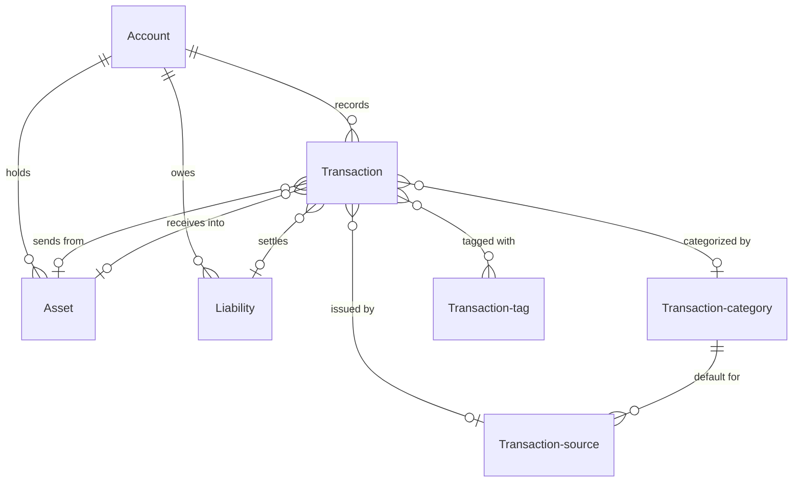
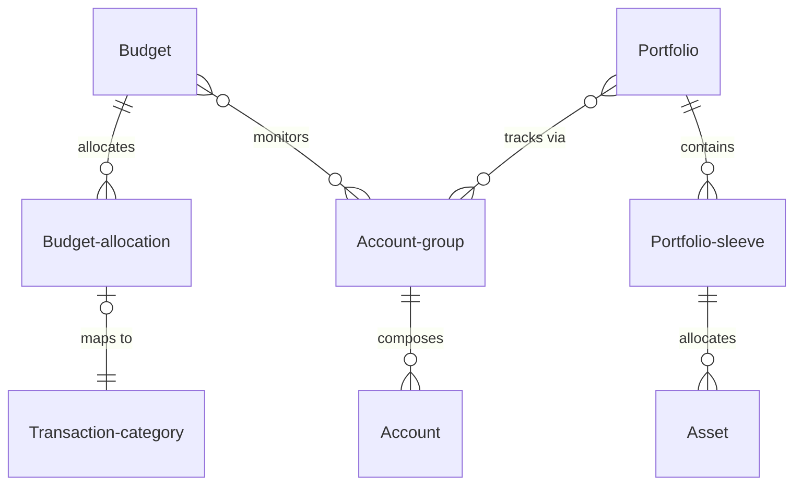
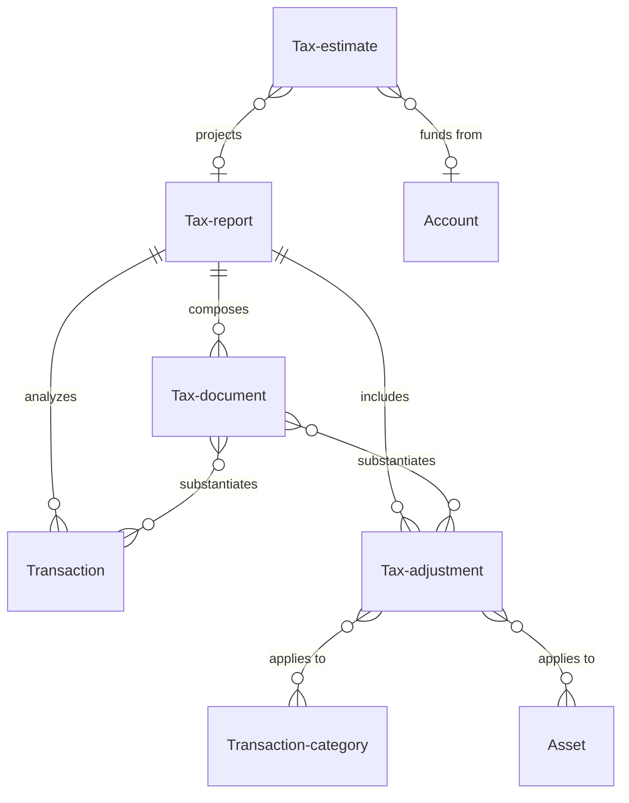
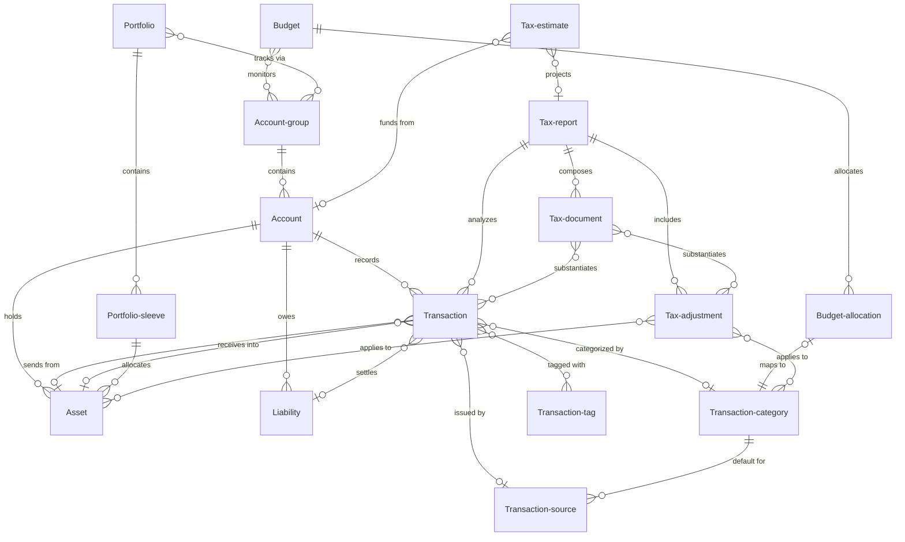
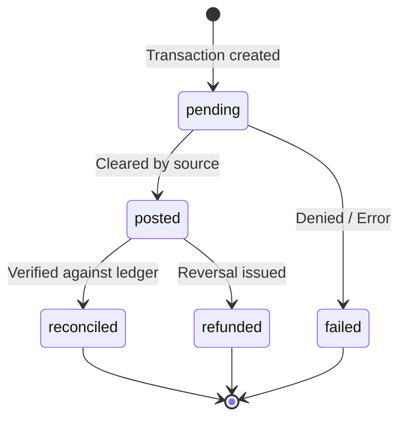
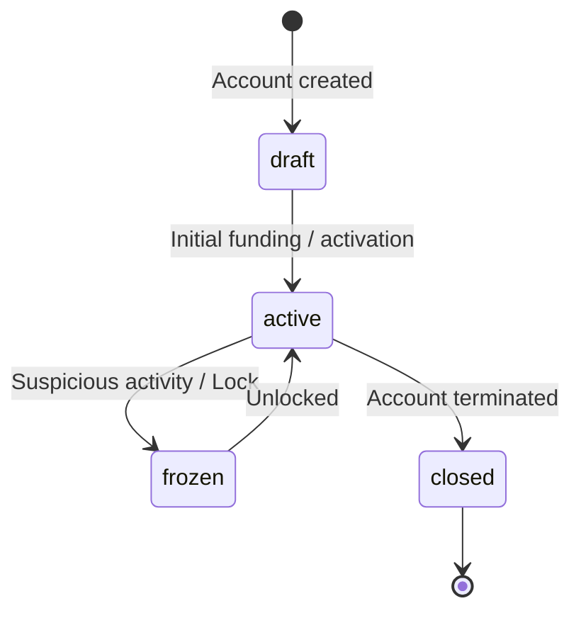
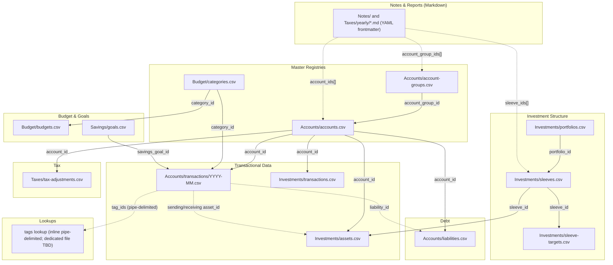

## Document overview

1. **User stories** to provide context to the workflows objects and features facilitate.
2. **Object definitions** to define the structure of the app and how objects connect.
3. **Rulesets** are the standard operating procedures that govern how objects behave and reconcile.
4. **Object references** are diagrams for how Objects, Features and Rulesets work together.
5. **Flat File Storage Strategy** details how data is stored and managed within the app using a filing system structure and iCloud.
6. **Architectural Recommendations** are additional considerations to potentially add as part of this review.

## User stories
These user stories are meant to provide context as to the overall functionality of the app and intended use.
* As a user I want to take full control over my financial planning personal, business and retirement. I want the tools to enable me acting as my own accountant, financial advisor and retirement planner.
- As a user I want to be review all my financial accounts across in one place. I have multiple accounts associated with different parts my life and different parts of my life have multiple accounts so its difficult to keep track of it all. I want to be able to review individual accounts and group them in a way that relates to my life. For example, for work I have a W2 based paycheck which is broken up into an HSA contribution, Insurance payment, 401k contributions, tax payments and take home pay. I also side business income, a brokerage account, credit cards, multiple savings and checking accounts and so on. I want to be able to organize these accounts in one place by downloading transaction and making manual adjustments to get a full picture of my financial history and current state. 
- As a user I want to be able to create budgets monitor specific accounts compared to those budgets, to set goals for spending and review how my spending habits compare to the goals I set. As part of those budgets I also want to set goals for savings contributions and investments, to make sure I consistently build my wealth on a monthly basis.
- As a user I want to be able to review my financial portfolio for wealth management based on specific accounts, assets and liabilities. I want to be able to view different portfolios and portfolio sleeves. For example, my investment accounts would be form a core investment portfolio with multiple sleeves and smaller satellite portfolios might represent specific short term goals and be comprised of both an investment and savings account. Realestate investments might make up a different portfolio.
- As a user I want to understand how my various income sources are taxed so I can prepare on a yearly basis to prep for taxes. I also want to keep track of important files for this tax year as well as previous years. I want to understand what I pay on a yearly basis as well as what I’ve already paid this year and still need to pay.
- As a user I want full control of my financial information in one place. I want to review my full financial history in order to plan for the future. I want a file system I can interact with like an app, as well as run analysis with different AI tools. To best work with AI, I want to manage data through markdown, CSV, yaml, json, python and other standardized file formats.

## Object definitions

> **Naming note:** Object names, their CSV file, and their id column are kept aligned so a schema file is easy to find from the object name. Single-word objects derive directly (Asset → `asset_id` → `assets.csv`); compound objects use the full snake_case name (Account-group → `account_group_id` → `account-groups.csv`). This renames three storage names that previously diverged — Entity→Account-group, Holding→Asset, Deduction→Tax-adjustment — see the **Naming Alignment & Resolution Plan** for the full mapping and downstream migration.

### Overview of Property Definitions
To ensure consistency and clarity across the architecture, every object is defined using a standard set of attributes. This uniform structure helps in understanding the role, data composition, and relationships of each object within the system. If a specific attribute does not apply to an object, its bullet is left blank.

The standard property groupings are:
- **description**: A brief, high-level summary of what the object represents.
- **purpose**: The "why"—the specific role this object plays in the overall system and the value it provides to the user.
- **properties**: The core data fields, metadata, or state variables stored within the object.
- **inherits-from**: Used when an object is a specialized subtype of a master object, sharing its core registry but adding specific fields.
- **belongs-to**: The inverse of "composes" or "references". Useful for defining the relationship from the perspective of the child object looking up.
- **composes**: A list of child objects or lower-level entities that this object contains or groups together.
- **references**: Other related objects that this object interacts with or references, outside of direct parent-child aggregation.
- **actions**: The operations, state changes, or user interactions that can be performed on or by this object.

~ NOTE:
- standard properties have been updated to better describe relationships 
- property and key names match the object name: lowercase, underscored, `_id`-suffixed keys derived from the object (e.g. `asset_id`, `account_group_id`); lowercase snake_case for all other fields.
~ END NOTE:

### Core Objects
These are objects that are used throughout the system and act as primary stores of value and means of organization. Core objects represent the raw financial data that everything else in the system is built upon.

##### Account
- description: Represents a specific account like savings, checking, brokerage, etc. Acts as a container for the assets, liabilities, and transactions tied to a single financial institution or holding.
- purpose: Acts as the primary ledger for tracking balances, liquidity, and financial activity for a specific financial institution or holding.
- properties:
	- account_id (string, primary key)
	- name (string)
	- account_group_id (reference, optional — the Account-group this account belongs to)
	- account_type (string/enum: cash, savings, brokerage, crypto, credit-card, loan, mortgage, ira, 401k, etc.)
	- status (string/enum: draft, active, frozen, closed)
	- current_balance (number, derived from the transaction ledger)
	- available_balance (number, derived from the transaction ledger)
- inherits-from:
	- 
- belongs-to:
	- Account-group
- composes:
	- Asset
	- Liability
	- Transaction
- references:
	- Budget
	- Portfolio
	- Tax-report
- actions:
	- Add, Edit, Delete
	- Manage transactions (add, edit, delete)
	- Manage assets (add, edit, delete)
	- Manage liabilities (add, edit, delete)

##### Transaction
- description: A purchase, sale, or transfer of money to obtain a service or good. Defines values for all financial items and keeps a record of how values change over time. Transactions are the backbone of the entire system because the full list of transactions gives a clear view of current and past financial states.
- purpose: Serves as the fundamental unit of financial activity, tracking the flow of money in, out, and within the user's financial ecosystem.
- properties:
	- transaction_id (string, primary key — unique per entry/row)
	- group_id (string, optional — shared across the entries of a multi-entry transaction; see Rulesets §3)
	- group_role (string/enum, optional: leg, gross, net, withholding — the entry's role within its group; see Rulesets §3)
	- description (string)
	- date (date)
	- amount (number — negative = debit/out, positive = credit/in)
	- account_id (reference)
	- type (string/enum: income, expense, transfer, trade, credit)
	- status (string/enum: pending, posted, reconciled, failed, refunded)
	- category_id (reference, optional)
	- source_id (reference, optional)
	- sending_asset_id (reference, optional — the Asset value is drawn from)
	- receiving_asset_id (reference, optional — the Asset value is added to)
	- liability_id (reference, optional — the Liability this entry settles or draws on)
	- tags (array of references, optional)
	- notes (string, optional)
- inherits-from:
	- 
- belongs-to:
	- Account
- composes:
	- 
- references:
	- Asset (via sending_asset_id / receiving_asset_id)
	- Liability
	- Transaction-category
	- Transaction-source
	- Transaction-tag
	- Tax-report
- actions:
	- Add, Edit, Delete
	- Categorize
	- Split into a multi-entry group
	- Link to asset / liability

##### Asset
- description: A holding of wealth within an account — cash, an equity position, crypto, real estate, etc. It can be created or updated by transactions but can also be edited directly.
- purpose: Represents positive value on the user's balance sheet, tracked over time to measure net worth.
- properties:
	- asset_id (string, primary key)
	- name (string)
	- asset_class (string/enum: cash, equity, crypto, real-estate)
	- current_value (number, derived)
	- cost_basis (number)
	- account_id (reference)
	- sleeve_id (reference, optional)
	- ticker (string, optional)
	- quantity (number, optional)
- inherits-from:
	- 
- belongs-to:
	- Account
- composes:
	- 
- references:
	- Portfolio-sleeve
	- Tax-adjustment
- actions:
	- Add, Edit, Delete
	- Update valuation
	- Link to transactions (buy/sell/trade)

##### Liability
- description: A debt position that needs to be repaid, like a line of credit, loan, or mortgage. It is held within an account alongside any related assets — e.g. a mortgage account holds the property as an Asset and the loan as a Liability.
- purpose: Represents negative value on the user's balance sheet. Tracking debts is critical for net worth calculations and payoff planning.
- properties:
	- liability_id (string, primary key)
	- name (string)
	- liability_type (string/enum: credit-card, loan, mortgage)
	- principal_balance (number, derived)
	- interest_rate (number)
	- account_id (reference)
	- credit_limit (number, optional — for credit-card and line-of-credit liabilities)
	- minimum_payment (number, optional)
	- due_date (date, optional)
- inherits-from:
	- 
- belongs-to:
	- Account
- composes:
	- 
- references:
	- Tax-adjustment
- actions:
	- Add, Edit, Delete
	- Record payment (creates a transfer Transaction)
	- Update interest rate

### Aggregators
Aggregators act as containers or organizers that pull together multiple core objects for targeted analysis or review.

##### Account-group
- description: Connects multiple accounts into themes or entities like a place of employment, a business, or a grouping of personal credit cards.
- purpose: The Account-group acts as the primary connecting object in the system. It composes accounts and connects larger features such as Budgets, Portfolios, and Tax reports.
- properties:
	- account_group_id (string, primary key)
	- name (string)
	- description (string, optional)
	- group_type (string/enum: personal, employment, business, custom)
- inherits-from:
	- 
- belongs-to:
	- 
- composes:
	- Account
- references:
	- Budget
	- Portfolio
	- Tax-report
- actions:
	- Add, Edit, Delete
	- Link/un-link account

##### Transaction-category
- description: A grouping mechanism to classify transactions for budgeting and reporting purposes (e.g., Groceries, Rent, Salary).
- purpose: Allows users to understand where their money is coming from and going, enabling budget tracking and spending analysis.
- properties:
	- category_id (string, primary key)
	- name (string)
	- type (string/enum: income, expense)
	- parent_category_id (reference, optional — for sub-categories)
	- account_group_id (reference, optional — categories may be group-scoped)
	- sort_order (number, optional)
	- icon (string/url, optional)
	- color (string/hex, optional)
- inherits-from:
	- 
- belongs-to:
	- 
- composes:
	- 
- references:
	- Transaction
	- Transaction-source
	- Budget-allocation
	- Tax-adjustment
- actions:
	- Add, Edit, Delete
	- Merge categories
	- Reassign transactions

##### Transaction-tag
- description: A flexible, user-defined label applied to transactions for ad-hoc organization across different categories (e.g., #vacation2026, #tax-deductible).
- purpose: Provides a secondary dimension of tracking that doesn't fit neatly into the primary category structure.
- properties:
	- tag_id (string, primary key)
	- name (string)
	- color (string/hex, optional)
- inherits-from:
	- 
- belongs-to:
	- 
- composes:
	- 
- references:
	- Transaction
- actions:
	- Add, Edit, Delete
	- Apply to transaction

##### Transaction-source
- description: The issuer of a transaction. In the case of an expense it's likely a merchant; for income it may be an employer or client.
- purpose: Normalizes and tracks the entities the user transacts with, improving auto-categorization and merchant-level reporting.
- properties:
	- source_id (string, primary key)
	- name (string)
	- default_category_id (reference, optional)
	- logo (string/url, optional)
- inherits-from:
	- 
- belongs-to:
	- 
- composes:
	- 
- references:
	- Transaction
	- Transaction-category
- actions:
	- Add, Edit, Delete
	- Map raw string to Source (ruleset)

### Budgeting feature
Budgeting feature objects extend core objects and aggregators with features for spending and saving. They allow users to set financial goals and track progress toward achieving them. This feature acts as a review layer on top of core objects and aggregators, and is not meant to be used for day-to-day expense tracking. Instead, it is meant to be used for long-term financial planning. This feature also acts as the primary interface for the review process.

##### Budget
- description: A grouping of account-groups and accounts used to monitor transactions against a predefined spending plan over a specific time period.
- purpose: Helps users constrain spending, plan for future expenses, and evaluate financial habits.
- properties:
	- budget_id (string, primary key)
	- name (string)
	- timeframe (string/enum: monthly, weekly, annual)
	- start_date (date)
	- end_date (date, optional)
	- account_group_ids (array of references, optional)
	- account_ids (array of references, optional)
- inherits-from:
	- 
- belongs-to:
	- 
- composes:
	- Budget-allocation
- references:
	- Account-group
	- Account
- actions:
	- Add, Edit, Delete
	- Rollover to next period
	- Compare actuals vs. planned

##### Budget-allocation
- description: A means of organizing monthly transactions as they relate to a goal. Specific funding assigned to a transaction category for a given timeframe.
- purpose: Sets the target threshold for spending or saving within a specific transaction category to guide user behavior.
- properties:
	- allocation_id (string, primary key)
	- budget_id (reference)
	- category_id (reference)
	- type (string/enum: spending, savings)
	- amount (number)
	- rollover_amount (number, optional)
	- period (string/date)
- inherits-from:
	- 
- belongs-to:
	- Budget
- composes:
	- 
- references:
	- Transaction-category
- actions:
	- Add, Edit, Delete
	- Adjust allocation amount
	- Map to transaction category

### Portfolio feature
Portfolio feature objects extend core objects and aggregators with features for wealth building. They allow users to set financial goals and track progress toward achieving them. This feature acts as a review layer on top of core objects and aggregators, and is not meant to be used for day-to-day transactional tracking. Instead, it is meant to be used for long-term wealth building. This feature also acts as the primary interface for the review process.

##### Portfolio
- description: A high-level container for tracking long-term assets, investments, and savings goals outside of day-to-day transactional budgets. (Adopted by r6-review — no formal object previously existed; see Naming Alignment.)
- purpose: Allows users to group and evaluate assets based on specific financial goals, time horizons, and risk profiles.
- properties:
	- portfolio_id (string, primary key)
	- name (string)
	- description (string, optional)
	- strategy (string, optional)
	- goal (string, optional)
	- timeframe (string, optional)
	- type (string/enum: retirement, brokerage, crypto, savings)
	- account_group_ids (array of references, optional — account-groups this portfolio tracks)
- inherits-from:
	- 
- belongs-to:
	- 
- composes:
	- Portfolio-sleeve
- references:
	- Account-group
- actions:
	- Add, Edit, Delete
	- Rebalance
	- Calculate performance
- storage: new file `Investments/portfolios.csv`; add a `portfolio_id` FK to `sleeves.csv`.

##### Portfolio-sleeve
- description: A sub-division within a portfolio, often representing a specific strategy, asset class, or sub-goal.
- purpose: Enables granular tracking and strategy implementation within a larger, unified portfolio.
- properties:
	- sleeve_id (string, primary key)
	- portfolio_id (reference)
	- name (string)
	- goal (string, optional)
	- target_allocation_percentage (number)
- inherits-from:
	- 
- belongs-to:
	- Portfolio
- composes:
	- 
- references:
	- Asset
- actions:
	- Add, Edit, Delete
	- Adjust target allocation

~ NOTE:
- the next review will need to outline public endpoints for live data related to assets.
- ideally current_value of an asset is pulled from live data rather than something stored in files. The value in that number comes from always being up to date.
~ END NOTE:

### Tax records feature
Tax records feature objects extend core objects and aggregators with features for tax records. They educate users about tax liabilities, deductions and credits and help them plan for tax season. They also allow users to generate tax reports for a given fiscal year and archive past years as well as store tax related documents. This feature also acts as the primary interface for the review process.

##### Tax-report
- description: A generated summary that analyzes transactions and composes the tax adjustments and documents for a fiscal year's filing.
- purpose: Provides a streamlined, exportable view of taxable events and deductible expenses for a given fiscal year.
- properties:
	- report_id (string, primary key)
	- fiscal_year (number)
	- generation_date (date)
	- status (string/enum: draft, filed, archived)
	- notes (string, optional)
- inherits-from:
	- 
- belongs-to:
	- 
- composes:
	- Tax-document
	- Tax-adjustment
- references:
	- Transaction
- actions:
	- Generate
	- Export (PDF/CSV)
	- Archive
	- Delete

##### Tax-adjustment
- description: A rule or modifier that accounts for tax liabilities, deductions, and credits related to specific transactions, assets, or accounts.
- purpose: Ensures the net worth and cash flow calculations accurately reflect tax implications (e.g., pre-tax vs. post-tax), and captures deductible events for filing.
- properties:
	- tax_adjustment_id (string, primary key)
	- name (string)
	- adjustment_type (string/enum: standard, itemized, business-expense, credit, liability)
	- account_group_id (reference, optional)
	- account_id (reference, optional)
	- transaction_id (reference, optional)
	- category_id (reference, optional)
	- asset_id (reference, optional)
	- liability_id (reference, optional)
	- tax_year (number)
	- receipt_path (string/url, optional)
	- notes (string, optional)
- inherits-from:
	- 
- belongs-to:
	- Tax-report
- composes:
	- 
- references:
	- Transaction
	- Transaction-category
	- Asset
	- Liability
	- Account
	- Account-group
- actions:
	- Add, Edit, Delete
	- Apply adjustment

##### Tax-estimate
- description: A projection of tax liabilities for the current fiscal year based on year-to-date transactions and anticipated income/deductions.
- purpose: Helps users plan for tax season by predicting tax owed or refunds due before the fiscal year ends, avoiding underpayment penalties.
- properties:
	- estimate_id (string, primary key)
	- fiscal_year (number)
	- estimated_income (number)
	- estimated_deductions (number)
	- projected_liability (number)
	- target_safe_harbor (number, optional)
- inherits-from:
	- 
- belongs-to:
	- 
- composes:
	- 
- references:
	- Tax-report
	- Account
	- Account-group
- actions:
	- Add, Edit, Delete
	- Recalculate based on YTD actuals
	- Log estimated payment

##### Tax-document
- description: A digital record of a tax-related document (e.g., W-2, 1099, 1098, donation receipt) needed for filing or audit defense.
- purpose: Stores physical or digital evidence to substantiate tax adjustments or reports, organizing them by fiscal year.
- properties:
	- document_id (string, primary key)
	- name (string)
	- file_path (string/url)
	- tax_year (number)
	- type (string/enum: income-form, deduction-receipt, prior-return, other)
- inherits-from:
	- 
- belongs-to:
	- Tax-report
- composes:
	- 
- references:
	- Transaction
	- Tax-adjustment
- actions:
	- Add, Edit, Delete
	- Link to transaction/adjustment
	- View document

## Rulesets
Rulesets act as the standard operating procedures for managing objects, features, and the connections between them. They define how the app classifies, validates, and reconciles records so the flat-file ledger stays internally consistent. These rules are enforced by the Validation Engine on every read and before every write.

### 1. Transaction classification
A transaction's `type` is determined primarily by which of its asset/liability links are populated. `trade` and `transfer` share the same column signature and are further distinguished by account scope (same account vs. different accounts):

| `type` | sending_asset_id | receiving_asset_id | liability_id | Example |
|---|---|---|---|---|
| `income` | null | set (e.g. USD) | — | Receiving a paycheck deposit |
| `expense` | set (e.g. USD) — or null for a credit-card purchase | null | optional — set for a credit-card purchase | Buying food at a restaurant (cash), or the same on a credit card |
| `trade` | set | set (**same account**) | — | Buying AAPL with USD — value moves from the USD asset into the AAPL asset (added to its cost basis) |
| `transfer` | set | set (**different account**) | optional | Moving money between two accounts, or paying down a credit card / loan |
| `credit` | null | set (e.g. USD) | set | Drawing down a loan or line of credit — cash received, a liability increased |

Derived rules:
- A transaction with **both** a sending and receiving asset is a `trade` (an asset swap within one account, e.g. USD → AAPL) or a `transfer` (when the assets sit in different accounts).
- A **credit-card purchase** has a null sending asset and increases its linked Liability balance; it is classified as an `expense`, not a transfer.
- A **payment toward a liability** (credit-card payment, loan payment, mortgage payment) is a `transfer`: cash leaves an asset and the liability's `principal_balance` is reduced.
- An **expense** with a blank receiving asset simply records value leaving the system (or, when the sending asset is also blank and a liability is set, value added to a liability balance).

### 2. Asset & liability lifecycle
- Every account must resolve to at least one Asset, one Liability, or both. A brokerage account holds multiple Assets (equities, ETFs); a mortgage account holds both an Asset (the property) and a Liability (the loan).
- Transactions uploaded directly to an account must each relate to an Asset or a Liability. On import, a transaction **may create** a new Asset or Liability dynamically; any dynamically created Asset or Liability is staged as `draft` and requires explicit manual approval before it affects balances.
- A `trade` transaction updates the receiving Asset's `cost_basis`/`quantity` and draws down the sending Asset.
- Balances are **computed on load, never authored by hand** (see Required Additions → Derived/computed fields): `current_balance`/`available_balance` and `Liability.principal_balance` are derived from the transaction ledger, while `Asset.current_value` is derived from latest prices (`prices.csv`) × `quantity`.

### 3. Multi-entry transactions
Some real-world events touch more than one account or asset at once. These are modeled as multiple Transaction rows that share a single `group_id`. Each row keeps its own unique `transaction_id` (the primary key); the `group_id` is the connector, and `group_role` records each row's part in the group. There are two multi-entry shapes:

**a. Balanced transfers (must net to zero).** Used for all transfers and liability payments. Every entry in the group sums to `0`.
```
group_id  account                          type      amount   group_role
group-1    checking account                 transfer   -100     leg
group-1    credit account                   transfer   +100     leg
```
```
group_id  account                          type      amount   group_role
group-1    checking account                 transfer   -100     leg
group-1    mortgage account (principal)     transfer    +75     leg
group-1    mortgage account (interest)      expense     +25     leg
```
- Validation rule: `SUM(amount) WHERE group_id = X` must equal `0`.

**b. Gross/net splits (do not net to zero).** Used for compound income events like a paycheck, where a gross amount is divided into withholdings and net take-home pay. These entries reference one another by `group_id` but are **not** required to net to zero; instead the group carries a gross value and a net value, and individual entries may be linked to a Tax-adjustment for tax reporting.
```
group_id  account            type      amount   group_role
group-2    employer           income    +5000     gross
group-2    HSA                transfer   -300      withholding
group-2    insurance          expense    -200      withholding
group-2    federal tax        expense    -900      withholding
group-2    state tax          expense    -300      withholding
group-2    checking           income    +3300      net
```
- Validation rule: a gross/net group designates exactly one `gross` entry and exactly one `net` entry; the `net` amount must equal the `gross` amount minus the sum of the `withholding` entries.
- Tax-relevant withholdings (federal/state withholding, pre-tax contributions) are the primary source of Tax-adjustment records and may be generated from these entries on review (see §7).

### 4. Amount sign convention (locked)
- Negative = debit (money out); positive = credit (money in).
- A redundant `direction` column may be kept for import-mapping readability, but the sign of `amount` is authoritative.
- The `credit` transaction **type** (a loan/line-of-credit draw-down) is distinct from the sign convention's "credit" (a positive amount). Type describes the event; sign describes the direction.

### 5. Source normalization & auto-categorization
- On import, the raw issuer string is mapped to a Transaction-source via a user-maintained ruleset (raw string match → `source_id`).
- A Transaction-source may carry a `default_category_id`; newly imported transactions from that source inherit the default Transaction-category unless the user overrides it.

### 6. Referential integrity & IDs
- Every `_id` reference must resolve to an existing primary key in its target file on vault load (see Required Additions → Referential integrity).
- Primary keys (`transaction_id`, `account_id`, …) are unique within their file. A `group_id` is shared across multi-entry rows and is **not** a primary key — this is also why the Account-group primary key is `account_group_id` rather than `group_id`, to avoid colliding with the multi-entry connector.
- Deleting an object triggers a reference check that surfaces all inbound references before proceeding.

### 7. Tax-adjustment linkage
- A Tax-adjustment references the Transaction(s), Transaction-category, Asset(s), Liability(ies), Account(s), or Account-group it applies to (via the optional `transaction_id`/`category_id`/`asset_id`/`liability_id`/`account_id`/`account_group_id` links), plus a `tax_year`.
- Withholdings and pre-tax contributions recorded as gross/net split entries (§3b) are the primary source of Tax-adjustment records.
- A paycheck's gross and net values are derived from its `group_role` entries rather than stored as a separate balanced transaction, because a gross/net group intentionally does not net to zero.

---
---
## Object references

### 1. Core Objects Architecture
This diagram focuses on the primary financial entities and how they relate to the ledger. `account_type` is an enum column on Account (not a separate object), so it is not drawn as a node.


### 2. Containers Architecture
This diagram focuses on how user-defined groups organize core objects for tracking and goals.


### 3. Tax Records Architecture
This diagram focuses on how tax-related records and plans interact with raw financial data.


### 4. Overall Architecture
This diagram provides a comprehensive view showing the intersection of Core Objects, Containers, and Tax records across the full system.


### 5. State Machine Diagrams
Lifecycle tracking for volatile objects is crucial for accurate financial reporting and reconciliation.

**Transaction Lifecycle** — aligns with `Transaction.status` enum: `pending, posted, reconciled, failed, refunded`


**Account Lifecycle** — aligns with `Account.status` enum: `draft, active, frozen, closed`


---
## Flat File Storage Strategy

This section maps the objects defined above to the existing flat file architecture established in `technical-design.md`. The system uses **CSV files as the source of truth** for structured financial data and **Markdown files with YAML frontmatter** for configuration, notes, and generated reports. There is no hidden database — files are the database. CSV filenames and id columns are kept aligned with the object name so a schema file is trivially locatable.

### Storage Format Decision Matrix
Each object is stored as either a **Markdown file** (`.md` with YAML frontmatter) or a **CSV file** (`.csv`), based on these criteria:

| Criteria | Markdown (`.md`) | CSV (`.csv`) |
|---|---|---|
| Best for | Configuration, notes, generated reports | Structured financial records with uniform columns |
| Identity | YAML frontmatter fields or filename | Row-level ID column within the file |
| Relationships | YAML frontmatter arrays (account_group_ids, account_ids, etc.) | Column references (foreign keys as string IDs) |
| Git diffing | Human-readable, line-level diffs | Row-level diffs, harder to review at scale |
| Performance | Fine for low-count read-once files | Required for high-volume, frequently-queried data |

### Object-to-File Mapping

The existing architecture uses **unified master CSV registries** rather than folder-per-entity nesting. All accounts live in a single `accounts.csv`; all transactions share monthly-partitioned files distinguished by `account_id`. The **Storage** column shows the (aligned) CSV file and id key; the **Former name** column flags the three files/keys being renamed so the object, file, and id all match.

| Object | Storage (file → id key) | Former name (migrate) | Format | Notes |
|---|---|---|---|---|
| **Account-group** | `Accounts/account-groups.csv` → `account_group_id` | Entity / `entities.csv` / `entity_id` | `.csv` | Master registry of all account groups. |
| **Account** | `Accounts/accounts.csv` → `account_id` | — | `.csv` | **Master registry** — the critical system dependency. All account types in a single file with optional columns for investment metadata. |
| **Account-type** | `accounts.csv` → `account_type` (column) | — | column | Stored as an enum column within the master accounts file, not a separate file or object. |
| **Transaction** | `Accounts/transactions/YYYY-MM.csv` → `transaction_id` | — | `.csv` | Monthly-partitioned. Unified ledger for all account types. Multi-entry rows share a `group_id`; each row keeps a unique `transaction_id`. Business transactions distinguished by `BX-` ID prefix. |
| **Transaction-category** | `Budget/categories.csv` → `category_id` | — (already aligned) | `.csv` | Shared lookup table. Supports parent-child via `parent_category_id`. |
| **Transaction-tag** | TBD → `tag_id` | — | `.csv` | No tag representation exists in tech-design yet. Tags may be stored as pipe-delimited values within transactions, or as a dedicated `tags.csv` lookup. Needs decision. |
| **Transaction-source** | `YYYY-MM.csv` → `merchant` (column) | — | column | No dedicated object in tech-design; the issuer is captured inline as the raw `merchant`/payer string. A dedicated `transaction-sources.csv` (`source_id`) lookup may be added for normalization. |
| **Asset** | `Investments/assets.csv` → `asset_id` | Holding / `holdings.csv` / `holding_id` | `.csv` | Current positions across all asset classes (cash, equity, crypto, real-estate). Linked to accounts via `account_id` and to sleeves via `sleeve_id`. |
| **Liability** | `Accounts/liabilities.csv` → `liability_id` | — (new) | `.csv` | **New file.** Debt positions (loans, mortgages, credit lines) held within accounts. `principal_balance` derived from the ledger. |
| **Budget** | `Budget/budgets.csv` → `budget_id` | — | `.csv` | Budget targets per category per period. |
| **Budget-allocation** | `Budget/budgets.csv` rows → `allocation_id` | — | rows | Each row is effectively an allocation (category + period + amount + type). |
| **Portfolio** | `Investments/portfolios.csv` → `portfolio_id` | — (new) | `.csv` | **New file.** Parent container grouping sleeves. Add a `portfolio_id` FK to `sleeves.csv`. |
| **Portfolio-sleeve** | `Investments/sleeves.csv` (+ `sleeve-targets.csv`) → `sleeve_id` | — (already aligned) | `.csv` | Sleeve definitions and target allocation weights. |
| **Tax-adjustment** | `Taxes/tax-adjustments.csv` → `tax_adjustment_id` | Deduction / `deductions.csv` / `deduction_id` | `.csv` | All adjustment types via the `adjustment_type` enum column. |
| **Tax-report** | `Taxes/yearly/YYYY-tax-notes.md` → `report_id` | — | `.md` | YAML frontmatter for metadata, markdown body for report content. |
| **Tax-document** | `Taxes/documents.csv` → `document_id` | — | `.csv` | Unified registry of tax documents pointing to file paths. |
| **Tax-estimate** | `Taxes/estimates.csv` → `estimate_id` | — | `.csv` | Projection of tax liabilities for planning. |

### Vault Directory Structure
This tree aligns with the existing domain-based folder organization:
```
Finance/
├── Workspace.md                          # Workspace identity (YAML frontmatter)
├── .finance-meta/                        # App-managed metadata (NOT source of truth)
│   ├── manifest.json                     # File discovery cache, hashes, validation
│   ├── schemas/                          # JSON schema definitions per CSV type
│   ├── backups/                          # Timestamped backups before every write
│   └── logs/                             # repair-log.csv, import-log.csv
│
├── Accounts/
│   ├── accounts.csv                      # MASTER account registry (ALL types)
│   ├── account-groups.csv                # Account-group registry (was entities.csv)
│   ├── liabilities.csv                   # Debt positions (= Liability), linked by account_id
│   ├── account-rules.csv                 # Income/expense estimates per account
│   └── transactions/
│       ├── 2026-01.csv                   # Monthly-partitioned unified transaction ledger
│       ├── 2026-02.csv
│       └── ...
│
├── Budget/
│   ├── categories.csv                    # Transaction-category definitions
│   ├── budgets.csv                       # Monthly budget targets per category
│   └── savings-goal-contributions.csv
│
├── Savings/
│   ├── goals.csv                         # Savings goals
│   └── progress.csv                      # Progress snapshots
│
├── Investments/
│   ├── assets.csv                        # Current positions (= Asset, was holdings.csv)
│   ├── transactions.csv                  # Trades (buy/sell)
│   ├── prices.csv                        # Price history
│   ├── dividends.csv
│   ├── tax-lots.csv
│   ├── portfolios.csv                    # Portfolio definitions (= Portfolio)
│   ├── sleeves.csv                       # Sleeve definitions (= Portfolio-sleeve), with portfolio_id FK
│   ├── sleeve-targets.csv                # Target weights per sleeve
│   └── benchmarks/
│       └── sp500.csv
│
├── Taxes/
│   ├── estimated-payments.csv
│   ├── settings.csv                      # Key-value tax settings
│   ├── tax-adjustments.csv               # All adjustment types (= Tax-adjustment, was deductions.csv)
│   ├── documents.csv                     # Registry of tax documents
│   ├── estimates.csv                     # Projections of tax liabilities
│   ├── archive/                          # Read-only prior-year snapshots
│   └── yearly/
│       ├── 2026-tax-notes.md
│       └── 2026-prep-checklist.md
│
└── Notes/
    ├── monthly/                           # Monthly review notes
    └── strategy/                          # IPS, tax strategy, etc.
```

### Referencing Conventions
This list describes how objects reference each other within the flat file system:

1. **Master registries as single source**: `accounts.csv` is the canonical registry. Every other file references `account_id` from it. `account-groups.csv` is the canonical registry for account-groups; accounts reference `account_group_id` from it.
2. **String-based foreign keys in CSV columns**: Cross-object relationships are expressed by ID columns (e.g., `category_id` in a transaction row references a row in `categories.csv`). These are always string-typed for stability.
3. **Monthly partitioning for transactions**: Rather than scoping transactions per-account, all transactions live in unified `YYYY-MM.csv` files. The `account_id` column filters by account (and resolves the owning account-group through `accounts.csv`); the ID prefix (`BX-`) distinguishes business transactions.
4. **Pipe-delimited arrays for many-to-many**: Tags on transactions are stored as a pipe-delimited list within a single CSV column (e.g., `tag-1|tag-2|tag-3`). This avoids the need for a separate join table.
5. **YAML frontmatter arrays for markdown references**: Markdown files use YAML arrays to express relationships: `account_group_ids: [consulting-llc]`, `account_ids: [checking-main]`, `sleeve_ids: [core-growth]`.
6. **Multi-entry grouping by shared key**: Transfers and gross/net splits link their rows with a shared `group_id` while each row keeps a unique `transaction_id` (see Rulesets §3). The `group_id` is a connector, never a primary key.
7. **Source provenance on every record**: Each transaction carries `source_file` and `source_row` for traceability back to the exact import file and line.
8. **Amount sign convention (locked)**: Negative = debit (money out), positive = credit (money in). A redundant `direction` column is kept for import mapping readability.

### Relationship storage diagram
This flowchart visualizes the cross-file reference conventions above — how a record in one file points to a record in another, whether through a CSV foreign-key column (conventions 1–3, 6), a pipe-delimited array (convention 4), or a YAML frontmatter array (convention 5). The record-level conventions (source provenance and the amount sign convention) apply within individual rows rather than between files, so they are not drawn here.


---
### Required Additions for Flat File Database System

Beyond the object definitions and storage strategy above, the following system-level concerns must be addressed to build a production-ready flat file database:

### 1. Data Integrity & Validation Layer
- **Schema validation**: The existing architecture specifies JSON schemas in `.finance-meta/schemas/`. These must be kept in sync with the object definitions in this document. Each CSV type carries a `schema_version`; the app validates column presence, data types, and enum values on every read.
- **Referential integrity checks**: On vault load, the app must validate that all cross-file references resolve (e.g., every `category_id` in a transaction exists in `categories.csv`). Deleting an object should trigger a reference check surfacing all inbound references before proceeding.
- **ID uniqueness enforcement**: CSV-based objects need guaranteed unique IDs. The existing design uses prefixed IDs (`BX-` for business transactions). Recommend extending this convention to all object types and enforcing uniqueness at write time. Note: `group_id` is shared across multi-entry rows and is intentionally exempt from primary-key uniqueness (see Rulesets §3, §6).
- **Multi-entry group validation**: Balanced groups (transfers) must net to zero; gross/net groups must reconcile net = gross − withholdings (see Rulesets §3). These checks run before write.

### 2. Concurrency & File Locking
- **Safe write protocol**: The existing architecture mandates preview → timestamped backup → atomic apply → re-index → re-validate. This must be enforced for all objects.
- **Atomic writes**: CSV and markdown updates should write to a temp file first, then rename to prevent corruption on crash or power loss. Backups are stored in `.finance-meta/backups/`.
- **Operation queue**: If the app supports multiple windows or future sync, a write queue prevents simultaneous mutations to the same file. Multi-entry groups must be written as a single atomic unit so a group can never be half-applied.

### 3. Indexing & Query Performance
- **In-memory index**: On vault load, build an in-memory index of all IDs, slugs, and common query paths (e.g., transactions by date range, by category). The file system is the persistence layer; the in-memory graph is the query layer. The existing `manifest.json` already caches file discovery and hashes.
- **Lazy loading**: Monthly transaction files naturally partition data. The app should only load months within the active view range and page in older months on demand.
- **Derived/computed fields**: `Account.current_balance`/`available_balance` and `Liability.principal_balance` are computed from the transaction ledger on load; `Asset.current_value` is computed from latest prices (`prices.csv`) × `quantity`. Neither is stored as an authoritative value — this prevents drift. The CSV can cache the figure for display speed, but the transaction and price files are the source of truth.

### 4. Migration & Versioning
- **Schema versioning**: Each file type already carries a `schema_version` per the technical design. Breaking changes (rename, remove, type change, new required column) require incrementing the version and shipping a migration script. Adding optional columns is non-breaking.
- **Migration scripts**: As object schemas evolve, the app needs a migration runner that can transform existing vault files to the new format. This review introduces three **file/column renames** (`entities.csv`→`account-groups.csv`/`entity_id`→`account_group_id`/`entity_type`→`group_type`; `holdings.csv`→`assets.csv`/`holding_id`→`asset_id`; `deductions.csv`→`tax-adjustments.csv`/`deduction_id`→`tax_adjustment_id`/`deduction_type`→`adjustment_type`) plus two **new files** (`liabilities.csv`, `portfolios.csv` and the `portfolio_id` FK on `sleeves.csv`) — all require migration steps. Repairs are logged to `.finance-meta/logs/repair-log.csv`.

### 5. Backup & Recovery
- **Timestamped backups**: Already specified — every write creates a backup in `.finance-meta/backups/`.
- **Cloud storage abstraction**: Built around a `CloudStorageProvider` protocol so iCloud (v1) can be swapped for Google Drive, Dropbox, or local folder in v2.
- **Export/import**: Support full vault export as a single `.zip` archive and import from the same format for portability across machines.

### 6. Object Definition Gaps
The following objects are implied by the architecture but not yet formally defined in this review:

- **Settings / Workspace**: Global app configuration (vault path, default currency, date format, theme). Currently `Workspace.md` at vault root.
- **Savings-goal**: A goal-tracking object linked to transactions via `savings_goal_id`. Defined in `Savings/goals.csv` and `progress.csv` but not modeled in this review's object definitions.
- **Account-rule**: Income/expense estimates per account (`Accounts/account-rules.csv`). Used for cash flow projections but not defined here.
- **Currency**: If multi-currency support is planned, a Currency object (code, symbol, exchange rate) and a root-level `currencies.csv` lookup table will be needed. This interacts with the `cash` `asset_class` on Asset (currencies are cash assets).
- **Recurring-transaction**: A template for transactions that repeat on a schedule (e.g., monthly rent, bi-weekly paycheck). Would store frequency, next-due-date, and a reference to the base transaction template. A recurring paycheck would template a gross/net multi-entry group (Rulesets §3b).
- **Valuation-history**: For assets, a time-series log of historical values. `Investments/prices.csv` partially covers this for market securities but a generalized history for all asset classes is needed.
- **Audit-log**: A system-level append-only log of all mutations. Partially covered by `.finance-meta/logs/` but a formal `audit-log.csv` with structured columns (timestamp, user, action, file, before, after) would strengthen undo support.

### 7. Naming Alignment & Resolution Plan

This review aligns each object name with its CSV filename and id column so a schema file is easy to locate from the object name (and vice-versa). The object definitions, properties, ER diagrams, storage mapping, and vault tree earlier in this file all use these aligned names. **This section records the alignment rule, the three renames it requires, and the downstream migration.**

#### Alignment Rule
- **id key** = the object name in lowercase snake_case + `_id`. Single-word objects: `asset_id`, `budget_id`, `portfolio_id`. Compound objects: `account_group_id`, `tax_adjustment_id`. (Pre-existing compound keys that already contain the object's distinctive noun — `category_id`, `sleeve_id`, `source_id`, `tag_id`, `allocation_id`, `report_id`, `document_id`, `estimate_id` — are retained as-is; they already satisfy the rule.)
- **CSV filename** = the object name, lowercase, plural, hyphenated: `assets.csv`, `account-groups.csv`, `tax-adjustments.csv`.
- **Code identifiers** = camelCase of the id key: `assetId`, `accountGroupId`, `taxAdjustmentId`.

#### Renames Required (storage previously diverged from the object name)

| Object | New (aligned) | Previous | Notes |
|---|---|---|---|
| **Account-group** | `account-groups.csv` / `account_group_id` | Entity / `entities.csv` / `entity_id` | Full compound form used (`account_group_id`, not `group_id`) to avoid colliding with `Transaction.group_id`, the multi-entry connector. Enum column `entity_type` → `group_type`. |
| **Asset** | `assets.csv` / `asset_id` | Holding / `holdings.csv` / `holding_id` | `asset_class` enum (cash, equity, crypto, real-estate) covers all positions; the FK pair `sending_asset_id`/`receiving_asset_id` now matches the PK. |
| **Tax-adjustment** | `tax-adjustments.csv` / `tax_adjustment_id` | Deduction / `deductions.csv` / `deduction_id` | Enum column also renamed `deduction_type` → `adjustment_type`. |

> **Cost note.** These names are embedded in CSV headers, code identifiers (`entityId`, `holdingId`, `deductionId`), and the prototype. The rename is accepted deliberately for one-name-per-concept trackability; it is a coordinated migration, not a per-file edit. Capture it as a versioned schema migration (Required Additions §4) and a decision in `technical-design.md §21`.

#### New Objects / Files (no rename — net-new)
- **Liability** — `Accounts/liabilities.csv` / `liability_id`. First-class object held within accounts (a mortgage account holds both an Asset and a Liability). ER drafts that labeled this "Debt" are standardized to "Liability."
- **Portfolio** — `Investments/portfolios.csv` / `portfolio_id`. Parent container for sleeves; add a `portfolio_id` FK to `sleeves.csv`.

#### Enrichments Applied in This File
Independent of naming, the following were applied to the object definitions, rulesets, and ER diagrams:
1. **Transaction** gained `sending_asset_id`, `receiving_asset_id`, `liability_id`, `group_id`, `group_role`; the `type` enum gained `trade` and `credit`.
2. **Liability** kept as a first-class object with `principal_balance`, `interest_rate`, `credit_limit`, `minimum_payment`, `due_date`.
3. **Portfolio** added as a formal object (parent of Portfolio-sleeve) with `strategy` and the fields above.
4. **Transaction-category** gained `account_group_id` (group-scoped) and `sort_order`; **Asset** gained `sleeve_id`/`asset_class`; **Tax-adjustment** gained `adjustment_type`, `account_group_id`, `account_id`, `tax_year`, `receipt_path`, `notes`.
5. **Relationship fields corrected**: mislabeled `inherits-from: Account` on Transaction/Asset/Liability changed to `belongs-to: Account`.
6. **ER diagrams** removed the `Account-type` node (enum column, not an object) and added the asset/liability transaction relationships.
7. **Rulesets** authored, including multi-entry transaction rules (balanced transfers and gross/net paycheck splits).
8. **Relationship fields normalized**: each object's direct parent appears only under `belongs-to` (removed from `references`); Asset/Liability no longer "compose" Transaction (it references them); Budget-allocation `belongs-to` Budget; Portfolio gained `account_group_ids` and routes to Assets via Sleeves (the direct Portfolio→Asset diagram edge was dropped); Tax-adjustment gained optional `transaction_id`/`category_id`/`asset_id`/`liability_id` links to back its "applies to" references.

#### Downstream Document Migration Checklist

| Document | What to update |
|---|---|
| `docs/technical-design.md` | Rename `entities.csv`→`account-groups.csv` (`entity_id`→`account_group_id`, `entity_type`→`group_type`), `holdings.csv`→`assets.csv` (`holding_id`→`asset_id`), `deductions.csv`→`tax-adjustments.csv` (`deduction_id`→`tax_adjustment_id`, `deduction_type`→`adjustment_type`) across all 24 CSV specs and FK references. Add `portfolios.csv` and `liabilities.csv` schemas; add `portfolio_id` FK to `sleeves.csv`. Record the renames and the "Liability is a first-class object" decision in §21. Add multi-entry `group_id`/`group_role` columns to the transaction schema. |
| `docs/product-requirements.md` | Update object/feature names. Add Portfolio as a formal feature. Describe Liability as a first-class object held within accounts. |
| `docs/product-roadmap.md` | Add the file/column renames as a migration milestone; add Portfolio and the new liabilities/portfolios files to the appropriate phase. |
| `docs/project-management.md` | Add migration tasks for the three renames and two new files; update ticket naming. |
| `prototype/data.js` | Rename mock collections/keys: `entities`→`accountGroups`/`entityId`→`accountGroupId`, `holdings`→`assets`/`holdingId`→`assetId`, `deductions`→`taxAdjustments`/`deductionId`→`taxAdjustmentId`. Add mock `liabilities` and `portfolios`; add `portfolioId` to sleeves; add `sendingAssetId`/`receivingAssetId`/`groupId` to transactions. |
| `prototype/store.js` | Update object references to the aligned names; add multi-entry transaction handling. |

#### Naming Convention Rules (Going Forward)
To prevent future divergence, all new objects must follow these conventions:

1. **Object names**: Capitalized, hyphenated nouns (e.g., `Budget-allocation`, `Portfolio`). Use the most descriptive financially-standard term available.
2. **Primary keys**: Lowercase, underscored, `_id`-suffixed, derived from the object name (e.g., `account_group_id`, `asset_id`). Must match across all docs, schemas, code, and CSV headers.
3. **CSV filenames**: Lowercase, plural, hyphenated, derived from the object name (e.g., `assets.csv`, `account-groups.csv`).
4. **Code identifiers**: camelCase matching the id key (e.g., `accountGroupId`, `assetId`).
5. **One name per concept**: Object name, filename, and id column are all derivable from one another. No synonyms — if a storage name diverges from its object, rename it (as done for Entity/Holding/Deduction above).

## Architectural recommendations

1. **Data Flow / Pipeline Diagrams**: Given this is a financial app, we should map how external data is ingested. A sequence diagram showing the flow from an external source (e.g., a bank CSV export or, in V2, an API like Plaid) → raw rows → normalization into `Transaction` → source mapping & auto-categorization via `Transaction-source` → and updating `Account`/`Asset`/`Liability` balances would be invaluable. (Bank/brokerage sync is V2 per the constitution, so frame this as the import pipeline first.)
2. **Implement File Organization Proposal**: As this architectural documentation grows, this monolithic `r6-review.md` file will become a bottleneck. We should establish a scalable directory structure under `/docs/architecture/` to house distinct domain concerns:
    - **`/docs/architecture/index.md`**: The executive summary, system vision, and high-level ER diagrams.
    - **`/docs/architecture/core-domain.md`**: Detailed schemas, property constraints, and state machines for primary ledger entities (`Account`, `Transaction`, `Asset`, `Liability`).
    - **`/docs/architecture/containers-and-budgets.md`**: The logic for aggregation, including `Portfolio` management, `Budget` limits, and `Account-group` rules.
    - **`/docs/architecture/rulesets-and-taxes.md`**: Documentation on standard operating procedures, tax adjustments, and report generation engines.
    - **`/docs/architecture/data-pipelines.md`**: Integration diagrams, external import handling, and data normalization processes.
3. **Liability persistence & derived balances**: The new `Accounts/liabilities.csv` needs a formal schema, and the Domain layer needs a `LiabilityEngine` (or an extension of `AccountEngine`) that derives `principal_balance` from the transaction ledger the same way asset values and account balances are derived. Confirm payoff-planning fields (`minimum_payment`, `due_date`, `interest_rate`) are sufficient for amortization projections.
4. **Multi-entry transaction integrity & editor**: The `group_id`/`group_role` model (Rulesets §3) needs (a) a Validation Engine rule set — balanced groups net to zero, gross/net groups reconcile net = gross − withholdings — and (b) a dedicated multi-entry transaction editor in the UI, since a paycheck or a split mortgage payment cannot be entered one flat row at a time without breaking group invariants.
5. **Live market data for assets**: As flagged in the Portfolio-feature note, a future review should specify public price endpoints feeding `Asset.current_value` rather than storing stale values in files. This intersects with the deferred bank/brokerage sync; scope it as read-only price ingestion first.
6. **`account_type` as enum vs. object**: This review treats `account_type` as an enum column on Account and removed it as an ER node. Downstream docs should confirm this — there is no `account-types.csv` lookup, and the `_notes/account-types.md` research should be reconciled against the final enum value list.
7. **Schema-rename migration script**: The three file/column renames (Entity→Account-group, Holding→Asset, Deduction→Tax-adjustment) touch CSV headers, FK columns across many files, and prototype identifiers. Before downstream propagation, write a single deterministic migration script (with a dry-run/preview, per the Safe-writes principle) that performs all three renames atomically and updates `manifest.json` and `schema_version`, so the rename is reproducible rather than hand-applied per file.
